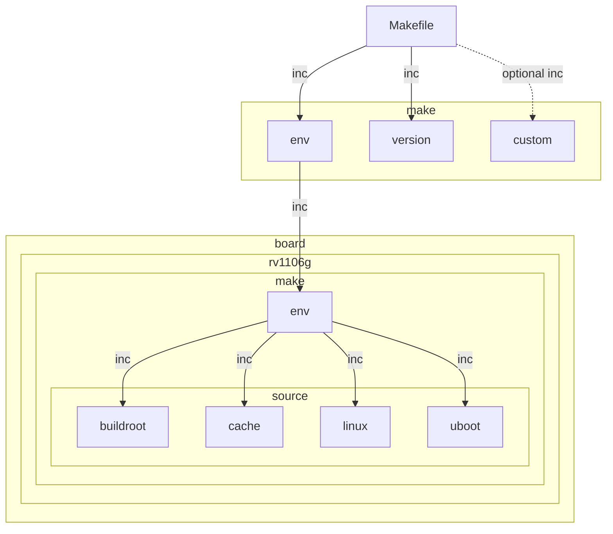

# Makefiles relationship

```mermaid
flowchart TB
    Makefile

    subgraph make1[make]
        make_env[env]
        make_version[version]
        make_custom[custom]
    end

    subgraph board
        subgraph rv1106g
            subgraph make2[make]
                board_env[env]
                subgraph source
                    board_buildroot[buildroot]
                    board_cache[cache]
                    board_linux[linux]
                    board_uboot[uboot]
                end
            end
        end
    end

    Makefile -- inc --> make_env
    Makefile -- inc--> make_version
    Makefile -. optional inc .-> make_custom

    make_env -- inc --> board_env

    board_env -- inc --> board_buildroot
    board_env -- inc --> board_cache
    board_env -- inc --> board_linux
    board_env -- inc --> board_uboot
```
