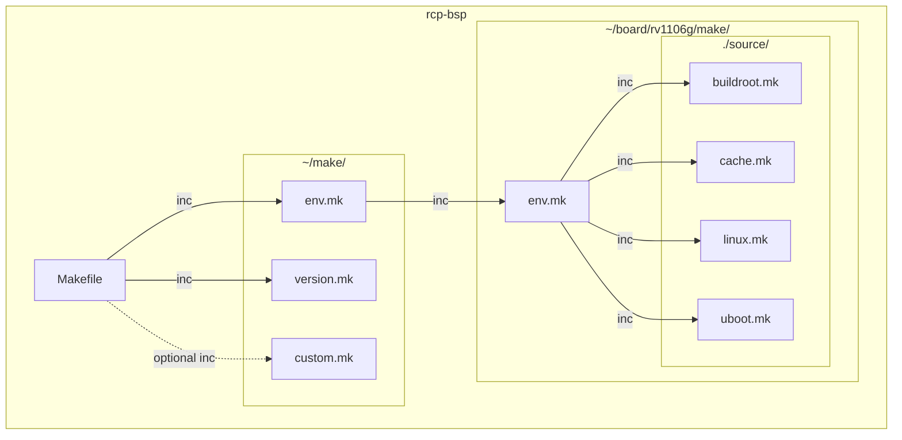
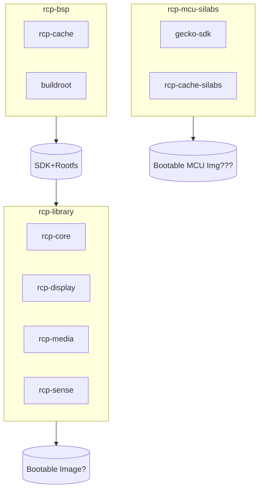

# Makefiles relationship

```mermaid
flowchart TB
    subgraph rcp-bsp
        Makefile
    
        subgraph make1[~/make/]
            make_env[env.mk]
            make_version[version.mk]
            make_custom[custom.mk]
        end

        Makefile -- inc --> make_env
        Makefile -- inc--> make_version
        Makefile -. optional inc .-> make_custom
    
        subgraph board[~/board/rv1106g/make/]
            board_env[env.mk]
            subgraph source[./source/]
                board_buildroot[buildroot.mk]
                board_cache[cache.mk]
                board_linux[linux.mk]
                board_uboot[uboot.mk]
            end
        end
    
        make_env -- inc --> board_env
    
        board_env -- inc --> board_buildroot
        board_env -- inc --> board_cache
        board_env -- inc --> board_linux
        board_env -- inc --> board_uboot
    end
```

# Repo Relationship

```mermaid
flowchart TB
    subgraph rcp-bsp
        rcp-cache
        buildroot
    end

    SDK[(SDK+Rootfs)]
    rcp-bsp --> SDK

    subgraph rcp-library
        rcp-core
        rcp-display
        rcp-media
        rcp-sense
    end

    SDK --> rcp-library

    CPUIMG[(Bootable Image?)]
    rcp-library --> CPUIMG

    subgraph rcp-mcu-silabs
        gecko-sdk
        rcp-cache-silabs
    end

    MCUIMG[(Bootable MCU Img???)]
    rcp-mcu-silabs --> MCUIMG
    
```
