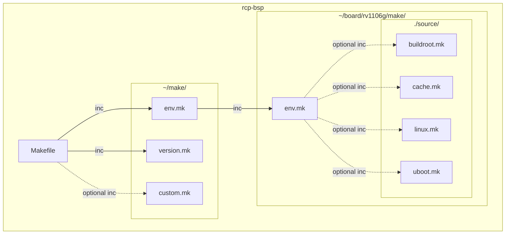
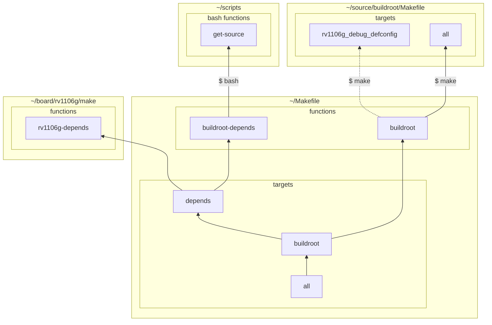
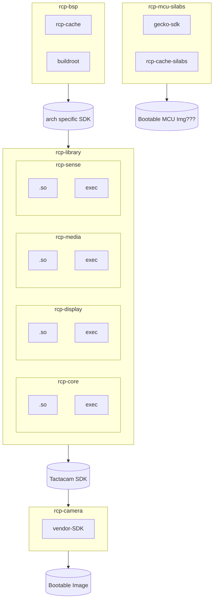

# Makefiles relationship
> [Syntax](https://mermaid.js.org/syntax/flowchart.html)

```mermaid
flowchart TB
    subgraph rcp-bsp
        Makefile
    
        subgraph make1[~/make/]
            make_env[env.mk]
            make_version[version.mk]
            make_custom[custom.mk]
        end

        Makefile -- inc --> make_env
        Makefile -- inc--> make_version
        Makefile -. optional inc .-> make_custom
    
        subgraph board[~/board/rv1106g/make/]
            board_env[env.mk]
            subgraph source[./source/]
                board_buildroot[buildroot.mk]
                board_cache[cache.mk]
                board_linux[linux.mk]
                board_uboot[uboot.mk]
            end
        end
    
        make_env -- inc --> board_env
    
        board_env -. optional inc .-> board_buildroot
        board_env -. optional inc .-> board_cache
        board_env -. optional inc .-> board_linux
        board_env -. optional inc .-> board_uboot
    end
```

# Makefiles target relationship

```mermaid
flowchart BT

%% ----- Objects -----
    subgraph make[~/Makefile]
        subgraph make_targets[targets]
            make_targets_all[all]
            make_targets_buildroot[buildroot]
            make_targets_depends[depends]
        end
        subgraph make_functions[functions]
            make_functions_buildroot[buildroot]
            make_functions_buildroot-deps[buildroot-depends]
        end
    end

    subgraph scripts[~/scripts]
        subgraph scripts_bash[bash functions]
            scripts_bash_get-source[get-source]
        end
    end

    subgraph board-rv1106g-make[~/board/rv1106g/make]
        subgraph board-rv1106g-make_functions[functions]
            board-rv1106g-make_functions_rv1106-deps[rv1106g-depends]
        end
    end

    subgraph buildroot-dir[~/source/buildroot/Makefile]
        subgraph buildroot-dir_targets[targets]
            buildroot-dir_targets_rv1106config[rv1106g_debug_defconfig]
            buildroot-dir_targets_all[all]
        end
    end

%% ----- Lines -----

    make_targets_all --> make_targets_buildroot
    make_targets_buildroot --> make_targets_depends
    make_targets_depends --> make_functions_buildroot-deps
    make_functions_buildroot-deps -- $ bash --> scripts_bash_get-source
    make_targets_depends --> board-rv1106g-make_functions_rv1106-deps
    make_targets_buildroot --> make_functions_buildroot
    make_functions_buildroot -. $ make .-> buildroot-dir_targets_rv1106config
    make_functions_buildroot -- $ make --> buildroot-dir_targets_all

    %%dependsFunc --> makeenvdep
    %%buildroottarget --> buildrootfunction
    %%buildrootfunction -.-> buildrootdirMakefileTarget

    %%buildrootdir ~~~ makeenv
    
```

# Repo Relationship

```mermaid
flowchart TB

    subgraph rcp-bsp
        rcp-cache
        buildroot
    end

    rcp-bsp --> SDK
    SDK[(arch specific SDK)]
    

    SDK --> rcp-library
    subgraph rcp-library
        subgraph rcp-core
            coreso[.so]
            coreexe[exec]
        end
        subgraph rcp-display
            displayso[.so]
            displayexe[exec]
        end
        subgraph rcp-media
            mediaso[.so]
            mediaexe[exec]
        end
        subgraph rcp-sense
            senseso[.so]
            senseexe[exec]
        end
    end

    rcp-library --> TACTACAMSDK
    TACTACAMSDK[(Tactacam SDK)]

    TACTACAMSDK --> rcp-camera
    subgraph rcp-camera
        vendor-SDK
    end

    rcp-camera --> BOOTABLE
    BOOTABLE[(Bootable Image)]

    subgraph rcp-mcu-silabs
        gecko-sdk
        rcp-cache-silabs
    end

    MCUIMG[(Bootable MCU Img???)]
    rcp-mcu-silabs --> MCUIMG
    
```
